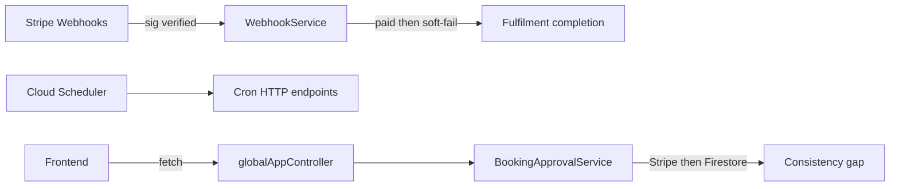

# SPORTSHUB Reliability & Observability Audit

**Date:** 2026-08-23  
**Scope:** Reliability under partial failure, races, and client recovery; ability to detect and act on failures. Security hardening is out of scope except where it directly affects operational reliability (e.g. deploy blast radius).

**Verdict:** Money-path retries and webhook idempotency are relatively solid. The weak spots are **post-Stripe app-state durability** (Stripe succeeds, Firestore status / fulfilment forms can lag), **client failure recovery**, and **ops signal** (logs exist; alerting, SLOs, and recovery jobs mostly do not).

---

## Reliability

### Critical

#### 1. Booking approval: Stripe first, Firestore second

Capture/cancel can succeed while status updates fail after retries. The code logs `CRITICAL / Manual intervention required` and throws, with no automated reconcile for “Stripe done / Firestore still PENDING”. This is a sticky money/state inconsistency.

**Evidence:** [`BookingApprovalService.java`](../functions/lib/functions/src/main/java/com/functions/tickets/services/BookingApprovalService.java) (`executeApprovalOperation` / `executeRejectionOperation`, then `updateOrderAndTicketStatusWithRetry`).

#### 2. Paid webhook → incomplete fulfilment (forms at risk)

Order/tickets persist first and are durable after the checkout transaction. Fulfilment completion (promote temp form responses, then delete the session) is best-effort with retries; failure still returns success to Stripe (explicit TODO), so Stripe will not retry. Cleanup cron deletes old sessions and is not a targeted recovery job — if it runs before repair, **temp form data can be lost** while tickets already exist.

**Evidence:** [`WebhookService.java`](../functions/lib/functions/src/main/java/com/functions/stripe/services/WebhookService.java) (fulfilment completion after checkout transaction); [`FulfilmentService.completeFulfilmentSession`](../functions/lib/functions/src/main/java/com/functions/fulfilment/services/FulfilmentService.java).

#### 3. Checkout reservation vs Stripe session

Vacancy is reserved in Firestore, then Stripe `Session.create` runs (no Idempotency-Key). Retries after accept-but-timeout can create duplicate sessions. Process death between reserve and session/revert leaves tickets reserved until expiry crons.

**Evidence:** [`CheckoutService.java`](../functions/lib/functions/src/main/java/com/functions/stripe/services/CheckoutService.java).

### High

| Finding | Why it hurts reliability | Key evidence |
| --- | --- | --- |
| Side effects inside Firestore transaction callbacks (user organiser lists, custom links) | Callbacks can retry → duplicate or non-atomic side effects | `CreateEventHandler`, `RecurringEventsCronService` |
| Booking approve/reject TOCTOU vs cron/concurrent ops | PENDING check + Stripe mutation are not one claim transaction | `BookingApprovalService` |
| No HTTP timeouts on Loops client; function `--timeout` not set in deploy scripts | Hung external calls can burn the whole invocation (including after money moved) | `EmailClient.java`, `deployFunctionsToGCloud.sh` |
| Cleanup cron returns 200 on partial failure | Scheduler will not retry; silent incomplete cleanup; can also erase recovery window for hanging fulfilment | `CleanupOldFulfilmentSessionsCronEndpoint` |
| Recurring cron weak outer failure isolation | One hard failure can fail the whole run; mid-batch misses lack a repair queue | `RecurringEventsCronEndpoint` / `RecurringEventsCronService` |
| No React / Next.js error boundaries | One render throw takes down the client tree | `frontend/app/` (no `error.tsx` / `global-error.tsx`) |
| `getErrorUrl` coerces `Error` to `"[object Object]"` | Booking/waitlist failures lose the real message | [`urlUtils.ts`](../frontend/services/src/urlUtils.ts) |
| Approve/decline double-submit unguarded | Concurrent clicks race the PENDING check; Stripe often rejects a second capture, but UX/race noise remains | `EventHubAttendees.tsx`, `EventDrilldownManageAttendeesPage.tsx` |
| `UserContext` does not clear user on auth null | Stale “logged in” UI after cross-tab or session end | [`UserContext.tsx`](../frontend/components/utility/UserContext.tsx) |
| GlobalApp `fetch`: no retry / abort / timeout | Transient blips fail hard; navigations leave in-flight races | [`functionsUtils.ts`](../frontend/services/src/functions/functionsUtils.ts) |
| Env URL falls back to DEVELOPMENT if env unset | Wrong backend under misconfig | `getGlobalAppControllerUrl` / related URL maps |

### Medium

- Email failures: retry then drop (no outbox/replay); webhook can still succeed after money moved.
- No circuit breaker / app-level backpressure if Stripe or Loops degrade (deploy concurrency only; prod webhook `concurrency 1` is good).
- Stripe Connect refresh races `userLoading` → flaky `/error`.
- FormResponder concurrent save / refetch races.
- Python scheduled full-collection scans with long timeouts as data grows.
- Master push deploys Java + Python to both `dev` and `prod` with no post-deploy smoke check.

### Strengths

- Stripe webhook signature verification and payload limits; handler failure → 500 so Stripe retries.
- Payment idempotency markers (`completedStripeCheckoutSessionIds` / payment intents).
- Prod webhook serialised (`concurrency 1`).
- Checkout reserve → Stripe → revert-on-failure; session and fulfilment expiry crons.
- Expire-pending leaves soft failures as PENDING for the next cron run.
- Booking button and onboarding submit guards; fulfilment timeout UX and session reuse.
- Branch CI covers frontend lint/tests/build and Java `mvn clean verify`.
- Documented Firestore transaction-retry guidance in [`docs/PATTERNS.md`](PATTERNS.md).

---

## Observability

### Gaps

| Area | Status |
| --- | --- |
| Alerting on CRITICAL logs, cron partial failure, or deploy failure | Absent in-repo |
| SLOs / error budgets / runbooks | Absent (`docs/` is architecture + patterns only) |
| Post-deploy health check | Absent |
| Java PostHog + Cloud Logging clients | Initialized in `FirebaseService`, not used for metrics/alerts |
| “CRITICAL / Manual intervention” paths | Log string only — no page or ticket |
| Frontend Faro | `pushLog` only; no `pushError` / exception pipeline |
| Faro `app.environment` | Hard-coded `"production"` even for preview |
| Correlation IDs across frontend ↔ Java ↔ Stripe | Partial / inconsistent |
| Python functions in CI | Not gated in [`branch_ci.yml`](../.github/workflows/branch_ci.yml) |
| Scheduler retry / attempt-deadline | Not declared in scheduler deploy scripts |

### What exists today

- Structured SLF4J logging on many money paths.
- Some cron summary counts (e.g. expire-pending `checked` / `expired` / `errors`).
- Frontend Grafana Faro + `Logger` wired for logs (not exceptions or alerts).
- Faro collector URLs for preview and production.

---

## Suggested priority (reliability / ops only)

1. **Alert on `CRITICAL` / Manual intervention logs** (cheap detection) **and** durable reconcile for booking approval when Stripe has moved money but Firestore is still PENDING.
2. Recovery job for paid-but-incomplete fulfilment: promote temp forms / complete the session **before** cleanup deletes the recovery window. Do not treat hangs as silent success to Stripe forever without a repair path.
3. Stripe `Session.create` Idempotency-Key; keep irreversible side effects out of Firestore transaction callbacks (`CreateEventHandler` / recurring cron organiser-list updates).
4. Client resilience, in roughly this order: fix `getErrorUrl` → approve/decline in-flight guards → clear user on auth null → harden GlobalApp `fetch` (timeout / limited retry / abort) → error boundaries.
5. Broader ops signal: cron non-2xx/partial failure alerts; Faro `pushError` + correct environment tag; post-deploy smoke; Python tests in CI; HTTP client timeouts on Loops (and related callers).

---

## Out of scope for this document

- Security remediations (token auth on endpoints, OIDC cron lockdown, Firestore rule tightening).
- Load/performance testing or formal SLO definition.
- Implementing the remediations listed above.
